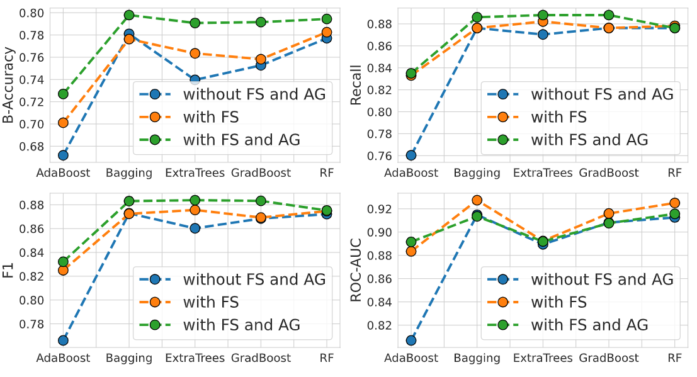

# STAD-FEBTE: Supervised Time Series Anomaly Detection by Feature Engineering, Balancing, and Tree-based Ensembles

 

## Key Contributions:
---
- STAD-FEBTE is a supervised framework for time series anomaly detection (AD) that combines automatic feature engineering with tree-based ensembles.
- Converting the time series dataset into its tabular counterpart allows generating synthetic anomalies and tackle class imbalance which is common in AD datasets.
- The framework can hanlde multivariate time series data extracted with different sampling frequencies.  
- The framework allows augmenting categorical features with time series data into an identical data structure.  

## Datasets:
---
The framework is process-independent, but it is benchmarked on two robotized screwing datasets. 

### AAUWSD (Aalborg University Wood Screwing Dataset):

 

- We publish AAUWSD dataset [here](https://drive.google.com/drive/folders/1m8_SermiKozrw_IYW1AoNfIaQh-sYpGd?usp=sharing), which is a labeled anomaly detection dataset for robotic screwing into wood profiles with 4 classes of anomalies . 
- The five classes of the dataset are: 
    - normal screwing
    - under-tightening: occurs when termination torque is less than fastening torque. 
    - over-tightening: occurs when termination torque is higher than fastening torque. 
    - pose anomaly: occurs when misalignment between screwdriver spindle and workpiece results in slippage. 
    - missing screw: occurs when the feeder fails to send a screw to the screwdriver. 

 

### AURSAD´ (Aalborg University Wood Screwing Dataset):
- This is a subset of AURSAD dataset ([paper](https://link.springer.com/10.1007/978-3-030-90700-6_25), [dataset](https://zenodo.org/record/4487073#.Y_9lNHbMIYs))
- To build this dataset: 
    - each screw tightening proces is sliced from the beginning of its engagement phase to the termination of its clamping phase. 
    - Insertion torque is measured as the only process attribute. 
    - TCP Pose, spatial velocity, and spatial acceleration are measured as task attributes. 

 

## Usage:
---
- Collect your time series dataset in the form of a list of dictionary objects saved as a `.dat` file with following keys:
    - `ftrs_tag`: keys of the time series measurements in each sample ; pass in a list even if single
    - `label_tag`: key of the label in each sample
    - `time_tag`: key of the time vector(s) in each sample
    - `catg_tag`: key of the categorical features in each sample
- For your convenience, we have created two synthetic datasets [here](https://drive.google.com/drive/folders/1m8_SermiKozrw_IYW1AoNfIaQh-sYpGd) showcasing how to save your dataset:
    - `synthetic_fixed.dat` which is a sample time series dataset with fixed time vector
    - `synthetic_varying.dat` which is a sample time series dataset with varying time vector 
- Update the `./config/config_data.yaml` file with following key-value pairs:
    - `preprocess` : 
        - `data_path` : path of the raw time series data in [dict1, dict2, ...] format, saved as binary (.dat file)
        - `data_name` : name of the dataset
        - `tab_path` : target path of the tabular dataset 
        - `ftrs_tag` : keys of the time series measurements in each sample ; pass in a list even if single
        - `label_tag` : key of the label in each sample
        - `time_tag` : key of the time vector(s) in each sample ; set to null if not available
        - `time_type` : type of the time vector of the dataset ; should be one of the {"fixed", "varying"}
        - `depth` : depth of feature extraction  ; should be one of the {"minimal", "efficient", "comprehensive"}
        - `n_jobs` : number of CPUs involved in data preprocessing
        - `catg_incl` : whether to include categorical features
        - `catg_tag` : key of the categorical features in each sample ; set to null if not available
        - `random_state` : randome state for reproducing results

    - `train` : 
        - `tab_path_` : dated child directory of tab_path to read the target tabular dataset from
        - `model_path` : path to save trained models
        - `model_names` : list of tree-based ensembles to train ; should be in ["bagging", "rf", "extra_trees", "ada_boost", "grad_boost"] ; pass in a list even if single
        - `train_on_FE` : Boolean ; whether to train the model on the output of FE module
        - `train_on_FS` : Boolean ; whether to train the model on the output of FS module
        - `n_estimators` : no. estimators in ensemble trees
        - `n_jobs` : no. CPUs involved in training
- Run `./src/preprocess_data.py` passing the path of `config_data.yaml` with `--config_path` command line argument. This will convert the raw time series dataset located in `config_data["preprocess"]["data_path"]` to its tabular counterpart by feature extraction, feature selection, and anomaly generation. The result is saved in a dated subdirectory of `config_data["preprocess"]["tab_path"]`. 
- Update `config_data["train"]["tab_path_"]` to the created dated subdirectory after preprocessing and run `./src/train.py` while passing the path of `config_data.yaml` with `--config_path` as command line argument. This will train and validate ensemble trees specified in `config_data["train"]["model_names"]` on the created tabular dataset. The trained models together with their performance metrics are saved in a dated subdirectory of `config_data["train"]["model_path"]`. 
- To apply STAD-FEBTE on any of the __AURSAD__, __AAUWSD__, __synthetic_fixed__, or __synthetic_varying__ datasets, simply uncomment their corresponding part in the `./config/config_data.yaml` file. 
- To reload the tabular datasets for which paper results are reported look into `./data/tab/STAD-FEBTE` [here](https://drive.google.com/drive/folders/1QbtvqMKbLgcpYe2xE64ljdW425GDbUU_). 
- To reload the trained ensemble trees for which the paper results are reported look into `./models/STAD-FEBTE` [here](https://drive.google.com/drive/folders/1Ohs5vR6DbpKA8TbGvv1-j7us19Nju5f4).  

## Results:
---
The presented framework could outperform common deep learning models applied on the raw time series data and detect anomalies with high accuracy in terms of different metrics. 

AAUWSD - STAD-FEBTE vs DL           | AAUWSD - Confusion matrices
:-------------------------------------:|:-------------------------:
      |  

AURSAD - STAD-FEBTE vs DL           | AURSAD - Performance matrices
:-------------------------------------:|:-------------------------:
      |  

## Dependency:
---
- Python3
- Numpy
- Pandas
- tsfresh
- imbalanced-learn
- scikit-learn
